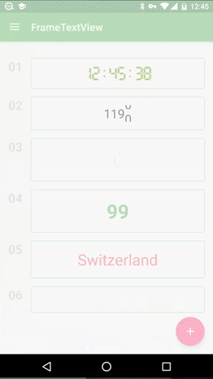

# FrameTextView



FrameTextView is a custom TextView can be interpolated or regularly rendered.  


custom content include:

+ text content(for example: ["One", "Two", "Three"], number 1 - 100)

+ text color(for example: ["#000000", "#FFFFFF"])

+ animation time

+ render time

+ render interval


Not only that, FrameTextView provide abundant features allow you to custom.

You can set your own ***TextProvider*** and ***ColorProvider***, to format any String and set any color.

There are some **Samples** in **frametextview-sample** module, you can also [contact me](http://effmx.com/contact/) for any question, have fun!


## Samples

```xml
<com.in404.frametextview.FrameTextView
    android:id="@+id/ftv_2"
    android:layout_width="wrap_content"
    android:layout_height="wrap_content"
    android:textSize="24sp"
    android:layout_gravity="center"
    app:autoStart="true"
    app:duration="5000"
    app:scrollSpeed="high"
    app:from="1190"
    app:to="1199"
    app:colorSequence="gradual"
    app:scroll="true"
    app:repeatCount="10" />

<com.in404.frametextview.FrameTextView
    android:id="@+id/ftv_3"
    android:layout_width="wrap_content"
    android:layout_height="wrap_content"
    android:textSize="38sp"
    android:textStyle="bold"
    android:layout_gravity="center"
    app:mode="interpolated"
    app:autoStart="true"
    app:duration="1500"
    app:from="0"
    app:to="689"
    app:colorSequence="gradual"
    app:interpolator="@android:interpolator/accelerate_decelerate"
    app:colorItems="@array/ftv_colorItems1" />

<com.in404.frametextview.FrameTextView
    android:id="@+id/ftv_4"
    android:layout_width="wrap_content"
    android:layout_height="wrap_content"
    android:textSize="38sp"
    android:textStyle="bold"
    android:layout_gravity="center"
    app:format="%1$s"
    app:mode="interpolated"
    app:autoStart="true"
    app:duration="5300"
    app:from="100"
    app:to="1"
    app:colorSequence="gradual"
    app:interpolator="@android:interpolator/decelerate_cubic"
    app:colorItems="@array/ftv_colorItems" />

<com.in404.frametextview.FrameTextView
    android:id="@+id/ftv_5"
    android:layout_width="wrap_content"
    android:layout_height="wrap_content"
    android:textSize="30sp"
    android:layout_gravity="center"
    app:mode="interval"
    app:autoStart="true"
    app:amount="20"
    app:interval="200"
    app:textItems="@array/countries"
    app:itemsSequence="random"
    app:colorSequence="asc"
    app:colorItems="@array/ftv_colorItems" />

<com.in404.frametextview.FrameTextView
    android:id="@+id/ftv_6"
    android:layout_width="250dp"
    android:layout_height="wrap_content"
    android:textSize="14sp"
    android:layout_gravity="center"
    android:textStyle=""
    app:mode="interval"
    app:autoStart="true"
    app:interval="100"
    app:to="@string/android"
    app:colorSequence="asc"
    app:itemsSequence="random"
    app:interpolator="@android:interpolator/decelerate_cubic" />
```


# License

```
Copyright 2015 Shawn Wang

Licensed under the Apache License, Version 2.0 (the "License");
you may not use this file except in compliance with the License.
You may obtain a copy of the License at

    http://www.apache.org/licenses/LICENSE-2.0

Unless required by applicable law or agreed to in writing, software
distributed under the License is distributed on an "AS IS" BASIS,
WITHOUT WARRANTIES OR CONDITIONS OF ANY KIND, either express or implied.
See the License for the specific language governing permissions and
limitations under the License.
```
